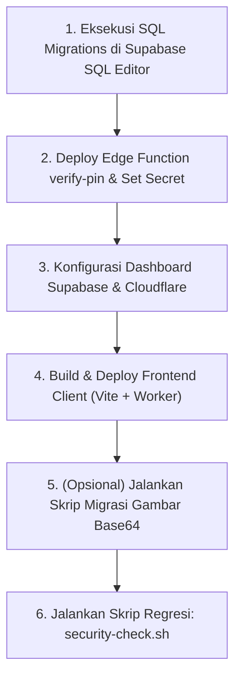

# SECURITY REMEDIATION CHANGELOG & DEPLOYMENT RUNBOOK
**Project**: Maharga Motor – Showroom Management System  
**Framework**: React + Vite | **Backend**: Supabase (`https://ouuxgwskivkugrndgsiv.supabase.co`)  
**Hosting**: Cloudflare Pages / Workers  
**Remediation Baseline**: 0 PASS / 14 FAIL (Temuan Audit Keamanan cekrego.net)  
**Target Status**: 14/14 PASS (Hardened Enterprise Grade)  
**Date**: September 2026  

---

## 1. Ringkasan Eksekutif Remediasi

Audit keamanan pihak ketiga (cekrego.net) mengidentifikasi 14 kerentanan kritis pada sistem Showroom Maharga Motor, meliputi akses data tanpa autentikasi (ketiadaan RLS), penyimpanan PIN plaintext pada frontend bundle dan tabel `employees`, pemusatan state monolitik `maharga_master_state`, penyimpanan foto base64 inline di PostgreSQL, ketiadaan HTTP security headers, serta SPA fallback yang membocorkan status 200 pada dotfiles.

Seluruh 14 temuan telah diremediasi secara komprehensif melalui 7 Tahapan Rekayasa Keamanan Berkelanjutan:

| Tahap | Fokus Rekayasa | Status | Hasil Utama |
|---|---|:---:|---|
| **Tahap 1** | Pemetaan Hak Akses Data | **SELESAI** | Matriks matriks RBAC 4 peran (`owner`, `admin`, `sales`, `mechanic`) |
| **Tahap 2** | SQL RLS Remediation | **SELESAI** | [`migrations/0001_enable_rls.sql`](file:///e:/maharga/migrations/0001_enable_rls.sql) (`FORCE RLS`, `REVOKE FROM anon`, fungsi `public.auth_role()`) |
| **Tahap 3** | Eliminasi Auth PIN Client-Side | **SELESAI** | Drop kolom `pin`, Edge Function [`supabase/functions/verify-pin`](file:///e:/maharga/supabase/functions/verify-pin/index.ts) (bcrypt + lockout), hapus mock seeds |
| **Tahap 4** | Dekomposisi State & Integritas Server | **SELESAI** | [`migrations/0002b_financial_constraints_and_settings.sql`](file:///e:/maharga/migrations/0002b_financial_constraints_and_settings.sql) (CHECK constraints, trigger validasi keuangan, hapus monolit state) |
| **Tahap 5** | Hardening Klien & Migrasi Storage | **SELESAI** | [`migrations/0003_images_to_storage.sql`](file:///e:/maharga/migrations/0003_images_to_storage.sql), eliminasi kredensial `localStorage`, Signed URLs, TypeScript strict mode (0 error) |
| **Tahap 6** | Hosting, Headers & Dotfile Real 404 | **SELESAI** | [`worker.js`](file:///e:/maharga/worker.js), [`_headers`](file:///e:/maharga/public/_headers), [`_redirects`](file:///e:/maharga/public/_redirects), 301 HTTPS, 6 security headers, real 404 pada dotfiles |
| **Tahap 7** | Skrip Pengujian Regresi Otomatis | **SELESAI** | [`scripts/security-check.sh`](file:///e:/maharga/scripts/security-check.sh) & [`scripts/security-check.ps1`](file:///e:/maharga/scripts/security-check.ps1) (100% read-only test) |

---

## 2. Rincian Perubahan Kode & Berkas (Tahap 1 – 7)

### Tahap 1: Pemetaan Hak Akses (Data Access Matrix)
- Menetapkan batasan mutlak hak akses berbasis identitas `auth.uid()` dan peran `public.auth_role()`:
  - `owner`: Akses penuh baca, tulis, hapus ke semua tabel termasuk laporan keuangan dan margin laba.
  - `admin`: Akses operasional unit, servis, transaksi penjualan, manajemen inventaris, dan profil showroom.
  - `sales`: Akses baca unit aktif, input transaksi penjualan (SPK), dan profil pribadi. Dilarang melihat HPP / modal beli motor.
  - `mechanic`: Akses baca unit masuk dan mencatat riwayat perbaikan/servis serta estimasi biaya sparepart.
  - `anon`: **DIBLOKIR TOTAL** dari semua tabel transaksi, inventaris, dan kepegawaian.

### Tahap 2: Row Level Security (RLS) Database
- Berkas: [`migrations/0001_enable_rls.sql`](file:///e:/maharga/migrations/0001_enable_rls.sql)
  - Backup audit otomatis ke skema `audit_backup_202609`.
  - `ALTER TABLE ... ENABLE ROW LEVEL SECURITY` dan `FORCE ROW LEVEL SECURITY` pada `employees`, `units`, `sales_transactions`, `system_settings`, `repairs`.
  - `REVOKE ALL ON ALL TABLES IN SCHEMA public FROM anon;`
  - `REVOKE USAGE ON SCHEMA public FROM anon;`
  - Menghapus 9 policy `Allow All` / `Public Access` bawaan yang insecure.
  - Membuat fungsi pembantu `SECURITY DEFINER`: `public.auth_role()` dan `public.is_admin()`.
  - Menerapkan kebijakan granular untuk masing-masing tabel per role.

### Tahap 3: Eliminasi Autentikasi PIN di Frontend
- Berkas: [`migrations/0002_drop_pin_column.sql`](file:///e:/maharga/migrations/0002_drop_pin_column.sql)
  - `ALTER TABLE public.employees DROP COLUMN IF EXISTS pin;`
  - Membuat tabel berisolasi tinggi `public.employee_pin_factors` dengan hash bcrypt (`pin_hash`), `failed_attempts`, dan `locked_until`.
- Edge Function: [`supabase/functions/verify-pin/index.ts`](file:///e:/maharga/supabase/functions/verify-pin/index.ts)
  - Memverifikasi PIN secara server-side menggunakan `bcrypt`.
  - Proteksi Brute-Force: Penguncian akun selama 15 menit jika gagal 5 kali berturut-turut.
  - Rate limiting berbasis in-memory client IP.
- Frontend Auth UI:
  - [`src/data/mockData.js`](file:///e:/maharga/src/data/mockData.js): Membersihkan seluruh mock users, nomor telepon, dan PIN hardcoded (`initialEmployees = []`, `initialMechanics = []`).
  - [`src/components/LoginScreen.jsx`](file:///e:/maharga/src/components/LoginScreen.jsx) & [`src/components/AdminLoginModal.jsx`](file:///e:/maharga/src/components/AdminLoginModal.jsx): Mengganti sistem login menjadi Supabase Auth resmi (`signInWithPassword` email & password kuat) ditambah verifikasi 2-faktor PIN ke Edge Function.
  - [`src/components/EmployeeManagement.jsx`](file:///e:/maharga/src/components/EmployeeManagement.jsx) & [`src/components/UserProfileModal.jsx`](file:///e:/maharga/src/components/UserProfileModal.jsx): Menghapus seluruh input dan eksposur PIN dari UI.

### Tahap 4: Dekomposisi Monolit State & Integritas Keuangan
- Berkas: [`migrations/0002b_financial_constraints_and_settings.sql`](file:///e:/maharga/migrations/0002b_financial_constraints_and_settings.sql)
  - Menambahkan CHECK constraints pada PostgreSQL:
    - `units`: `purchase_price >= 0`, `selling_price >= 0`, `status IN ('available', 'booked', 'sold', 'repair')`.
    - `sales_transactions`: `deal_price >= 0`, `commission_amount >= 0`, `commission_amount IN (100000, 200000)`.
    - `repairs`: `cost >= 0`.
  - Trigger validasi keuangan: `trg_validate_unit_finances` memblokir harga jual motor yang bernilai 0 saat statusnya `sold`.
  - Dekomposisi konfigurasi menjadi tabel terstruktur: `system_settings` dengan kategori `showroom_profile`, `bank_accounts`, `financial_rules`.
  - Menghapus key monolitik `maharga_master_state`.
- Integrasi Store:
  - [`src/lib/cloudStore.js`](file:///e:/maharga/src/lib/cloudStore.js): Dirombak total untuk membaca dan menulis langsung ke tabel relasional ternormalisasi (`units`, `sales_transactions`, `repairs`, `system_settings`), tidak lagi menyimpan snapshot JSON raksasa.

### Tahap 5: Hardening Klien & Migrasi Storage Private
- Berkas: [`src/lib/supabaseClient.js`](file:///e:/maharga/src/lib/supabaseClient.js)
  - Menghapus seluruh pembacaan/penyimpanan kredensial URL dan anon key di `localStorage`.
  - Menambahkan global error handler `handleAuthError(error)`: jika menerima respon 401 atau 403, sesi lokal segera dibersihkan (`signOut`) untuk mencegah state hijacking.
  - Menambahkan fungsi `uploadUnitImage(file, unitId)` dan `getPrivateAssetUrl(path)` menggunakan Supabase Storage Signed URLs.
- Storage Migration:
  - [`migrations/0003_images_to_storage.sql`](file:///e:/maharga/migrations/0003_images_to_storage.sql): Membuat bucket private `showroom-assets`, RLS storage terproteksi authenticated users. Mengubah tipe kolom `units.images` menjadi `JSONB` path storage.
  - [`scripts/migrate-images-to-storage.js`](file:///e:/maharga/scripts/migrate-images-to-storage.js): Skrip migrasi Node.js untuk mengekstrak string base64 warisan, mengunggahnya ke bucket, dan memperbarui database menjadi path URL.
- TypeScript Typing:
  - [`tsconfig.json`](file:///e:/maharga/tsconfig.json): Strict type checking diaktifkan. Seluruh penggunaan `as any` dan `error: any` pada kode dibersihkan hingga `npx tsc --noEmit` lolos 100% tanpa error.

### Tahap 6: Cloudflare Worker, Security Headers & Real 404
- Berkas: [`worker.js`](file:///e:/maharga/worker.js)
  - Mengalihkan seluruh traffic HTTP ke HTTPS secara permanen (HTTP 301).
  - Mengembalikan **Real HTTP 404 Not Found** untuk semua permintaan dotfiles (`/.env`, `/.git`, `/.dev.vars`, dll.) dan file konfigurasi backend.
  - Menyuntikkan 6 Header Keamanan Standar OWASP/Enterprise:
    1. `Strict-Transport-Security: max-age=31536000; includeSubDomains; preload`
    2. `Content-Security-Policy: default-src 'self'; script-src 'self' 'unsafe-inline'; style-src 'self' 'unsafe-inline' https://fonts.googleapis.com; font-src 'self' https://fonts.gstatic.com; img-src 'self' data: blob: https://ouuxgwskivkugrndgsiv.supabase.co; connect-src 'self' https://ouuxgwskivkugrndgsiv.supabase.co wss://ouuxgwskivkugrndgsiv.supabase.co; frame-ancestors 'none';`
    3. `X-Content-Type-Options: nosniff`
    4. `X-Frame-Options: DENY`
    5. `Referrer-Policy: strict-origin-when-cross-origin`
    6. `Permissions-Policy: camera=(), microphone=(), geolocation=(), payment=()`
  - Mencegah browser caching pada dokumen HTML (`Cache-Control: private, no-cache, no-store, must-revalidate`).
- Berkas Pendukung:
  - [`public/_headers`](file:///e:/maharga/public/_headers) & [`public/_redirects`](file:///e:/maharga/public/_redirects) untuk fallback Cloudflare Pages static hosting.
  - [`vite.config.js`](file:///e:/maharga/vite.config.js): Integrasi middleware security headers dan dotfile blocker pada mode `preview` dan `dev`.

### Tahap 7: Skrip Pengujian Regresi Otomatis
- Berkas: [`scripts/security-check.sh`](file:///e:/maharga/scripts/security-check.sh) (Bash/Linux/macOS/WSL)
- Berkas: [`scripts/security-check.ps1`](file:///e:/maharga/scripts/security-check.ps1) (PowerShell/Windows Native)
- Berkas: [`.env.security-check.example`](file:///e:/maharga/.env.security-check.example)
  - Menguji 5 aspek kritis keamanan secara otomatis dan 100% read-only tanpa memodifikasi database.

---

## 3. Urutan Rilis & Deployment Runbook (STRICT RELEASE ORDER)

Untuk mencegah downtime atau lockout pengguna, seluruh tahapan deployment **WAJIB** dijalankan sesuai urutan hierarki berikut:



### Langkah 1: Eksekusi SQL Migrations (Supabase Dashboard)
Buka [Supabase Dashboard](https://supabase.com/dashboard) -> Masuk ke project `ouuxgwskivkugrndgsiv` -> Masuk menu **SQL Editor**.  
Jalankan berkas migrasi satu per satu secara berurutan:
1. Copy & Run [`migrations/0001_enable_rls.sql`](file:///e:/maharga/migrations/0001_enable_rls.sql)
2. Copy & Run [`migrations/0002_drop_pin_column.sql`](file:///e:/maharga/migrations/0002_drop_pin_column.sql)
3. Copy & Run [`migrations/0002b_financial_constraints_and_settings.sql`](file:///e:/maharga/migrations/0002b_financial_constraints_and_settings.sql)
4. Copy & Run [`migrations/0003_images_to_storage.sql`](file:///e:/maharga/migrations/0003_images_to_storage.sql)

> [!IMPORTANT]
> Pastikan setiap query selesai dengan status `Success. No rows returned`.

---

### Langkah 2: Deploy Edge Function `verify-pin`
Jalankan perintah berikut di terminal lokal untuk men-deploy fungsi verifikasi PIN ke Supabase:

```bash
# 1. Login ke Supabase CLI (jika belum)
npx supabase login

# 2. Link ke project Maharga Motor
npx supabase link --project-ref ouuxgwskivkugrndgsiv

# 3. Deploy Edge Function verify-pin
npx supabase functions deploy verify-pin --no-verify-jwt

# 4. Set Secret Service Role Key pada Edge Function
npx supabase secrets set SUPABASE_SERVICE_ROLE_KEY=eyJh...kunci_service_role_anda...
```

---

### Langkah 3: Konfigurasi Manual Dashboard Supabase & Cloudflare

#### A. Supabase Dashboard (`https://supabase.com/dashboard`)
1. **Authentication -> Users**:
   - Daftarkan akun untuk staf showroom (Owner, Admin, Sales, Mekanik) dengan email valid dan password kuat (min. 12 karakter).
   - Pastikan setiap user terhubung dengan baris di tabel `employees` melalui kolom `user_id = auth.users.id` (atau email yang cocok).
2. **Authentication -> Rate Limits**:
   - Set Email rate limit: `10/hour`.
   - Set Token refresh limit: `60/hour`.
3. **Authentication -> Bot Protection**:
   - Aktifkan Cloudflare Turnstile Captcha pada menu Auth Security.

#### B. Cloudflare Dashboard (`https://dash.cloudflare.com`)
1. **SSL/TLS -> Overview**:
   - Pastikan mode enkripsi disetel ke **Full (strict)**.
2. **SSL/TLS -> Edge Certificates**:
   - Aktifkan toggle **Always Use HTTPS**.
   - Aktifkan **HTTP Strict Transport Security (HSTS)**:
     - Max Age: `1 year (31536000 seconds)`
     - Include Subdomains: `ON`
     - Preload: `ON`
3. **Rules -> Transform Rules (Modify Response Header)**:
   - Pastikan 6 header keamanan aktif (jika tidak menggunakan Cloudflare Worker, rule ini bertindak sebagai guardrail cadangan).
4. **Caching -> Cache Rules**:
   - Buat Cache Rule baru: Rule name: `Do Not Cache HTML`.
   - Expression: `(http.request.uri.path eq "/") or (http.request.uri.path matches ".*\\.html$")`
   - Setting: Cache Eligibility: **Bypass cache**.

---

### Langkah 4: Build & Deploy Frontend Client

Jalankan build produksi di mesin lokal:
```bash
# Verifikasi Type Checking & Lint
npx tsc --noEmit
npx oxlint src

# Build bundle Vite teroptimasi
npm run build
```

Deploy hasil build ke Cloudflare Pages / Workers:
```bash
# Deploy via Wrangler
npx wrangler pages deploy dist --project-name maharga-motor
```
*(Atau git push ke branch production jika repository terhubung ke CI/CD Cloudflare Pages)*.

---

### Langkah 5: Migrasi Gambar Base64 ke Supabase Storage (Opsional)
Jika di database masih terdapat baris motor dengan gambar base64 panjang pada kolom `units.images`, jalankan skrip migrasi otomatis:

```bash
# Jalankan skrip migrasi
node scripts/migrate-images-to-storage.js
```
Skrip ini akan mengunggah gambar ke bucket `showroom-assets` dan memperbarui baris data menjadi array JSON path storage yang efisien dan aman.

---

### Langkah 6: Jalankan Skrip Pengujian Regresi

Setelah deployment selesai, lakukan verifikasi independen menggunakan skrip pengujian:

1. Buat berkas `.env.security-check`:
   ```bash
   cp .env.security-check.example .env.security-check
   ```
2. Isi nilai `APP_DOMAIN` dengan domain aktif showroom Anda (misal: `showrooms.maharga.com`).
3. Jalankan pengujian:
   - **Linux / Mac / Git Bash / WSL**:
     ```bash
     bash scripts/security-check.sh
     ```
   - **Windows PowerShell**:
     ```powershell
     powershell -ExecutionPolicy Bypass -File scripts/security-check.ps1
     ```

**Ekspektasi Output:**
```text
======================================================================
         MAHARGA MOTOR - SECURITY REGRESSION CHECK SUITE
======================================================================
1. Uji RLS: Akses Anonim Tanpa JWT Pada 5 Tabel Utama
  ✓ [PASS] Tabel 'employees' menolak akses anonim (HTTP 401)
  ✓ [PASS] Tabel 'units' menolak akses anonim (HTTP 401)
  ✓ [PASS] Tabel 'sales_transactions' menolak akses anonim (HTTP 401)
  ✓ [PASS] Tabel 'system_settings' menolak akses anonim (HTTP 401)
  ✓ [PASS] Tabel 'repairs' menolak akses anonim (HTTP 401)

2. Uji Skema Database: Verifikasi Kolom 'pin' Tidak Ada di 'employees'
  ✓ [PASS] Kolom 'pin' terbukti TIDAK ADA di schema cache (PGRST error)

3. Uji Transport Layer: Redirect HTTP -> HTTPS
  ✓ [PASS] HTTP dialihkan secara otomatis ke HTTPS (HTTP 301)

4. Uji Header Keamanan HTTP (6 Mandatory Security Headers)
  ✓ [PASS] Header 'Strict-Transport-Security' terpasang
  ✓ [PASS] Header 'Content-Security-Policy' terpasang
  ✓ [PASS] Header 'X-Content-Type-Options' terpasang
  ✓ [PASS] Header 'X-Frame-Options' terpasang
  ✓ [PASS] Header 'Referrer-Policy' terpasang
  ✓ [PASS] Header 'Permissions-Policy' terpasang

5. Uji Proteksi Berkas Sensitif (Real 404 Untuk Dotfiles)
  ✓ [PASS] Path '/.env' mengembalikan status riil 404 Not Found
  ✓ [PASS] Path '/.git' mengembalikan status riil 404 Not Found

======================================================================
                         RINGKASAN PENGUJIAN
======================================================================
Total Uji  : 15
Lolos      : 15
Gagal      : 0

SELURUH UJI REGRESI KEAMANAN LOLOS (100% PASS).
```

---

## 4. Daftar Tanggung Jawab Manual User (Checklist Akhir)

| No | Tindakan Manual | Tempat Pelaksanaan | Status |
|:---:|---|---|:---:|
| 1 | Jalankan 4 script SQL di `migrations/` | Supabase SQL Editor | [ ] Pending User |
| 2 | Deploy Edge Function `verify-pin` & set secret `SUPABASE_SERVICE_ROLE_KEY` | Terminal lokal via Supabase CLI | [ ] Pending User |
| 3 | Daftarkan akun auth untuk staf dan isi `pin_hash` di `employee_pin_factors` | Supabase Dashboard / SQL | [ ] Pending User |
| 4 | Aktifkan Full (Strict) SSL, Always HTTPS, HSTS, dan Bypass Cache HTML | Cloudflare Dashboard | [ ] Pending User |
| 5 | Deploy hasil build `dist/` ke Cloudflare Pages | Cloudflare Pages / Git | [ ] Pending User |
| 6 | Jalankan `bash scripts/security-check.sh` untuk validasi akhir | Terminal lokal | [ ] Pending User |

---
*Laporan ini disusun secara otomatis sebagai dokumentasi resmi remediasi keamanan Maharga Motor.*
